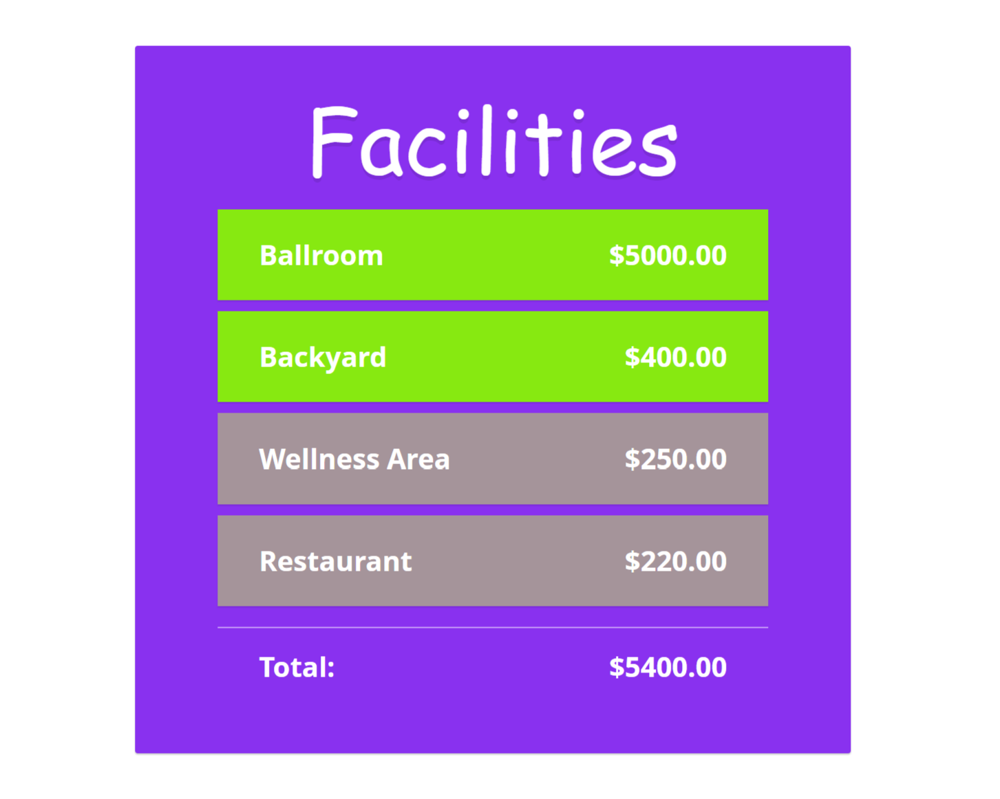

# Vue.js Form App

This project is a simple form application built using **Vue.js**, **HTML**, and **JavaScript**. It allows users to interact with various facilities, toggle items, and calculate a total cost based on user selections. The app also ensures proper currency formatting in USD($).

## Features
- **Dynamic Item Display**: Items are displayed dynamically using loops.
- **Item Toggle Functionality**: Items can be toggled on or off.
- **Total Calculation**: The app calculates the total cost based on user actions.
- **Currency Formatting**: All prices are displayed in USD format.
- **Code Cleanliness**: Follows Vue.js best practices with no errors or unnecessary components.

## Requirements
- Items are displayed using a loop.
- Items can be toggled on/off.
- Calculation of totals is handled via button actions.
- Prices are formatted as USD.
- **Part 1 Completion**: Commit message `Finished Part1`.
- Remove `node_modules` before final submission.
- Avoid the use of "Hello World" or Vue welcome components.
- **Part 2 Completion**: Commit message `Finished Part2`.
- Final submission must have no errors and include a GitHub repository link.

## Getting started
Follow these steps to set up and run the Vue.js form application locally.

### Technologies
- Basic knowledge of VueJS, HTML, and JavaScript
- - Basic knowledge of npm, and git
### Setup
- git clone https://www.github.com/tlklein/vuejs-form-app
- npm run dev

## About the Author
This project was completed by Trinity Klein for the CIS 4339 course at the University of Houston under the guidance of Professor Xuqing Wu. 

---

Feel free to contribute, provide feedback, or discuss improvements!
